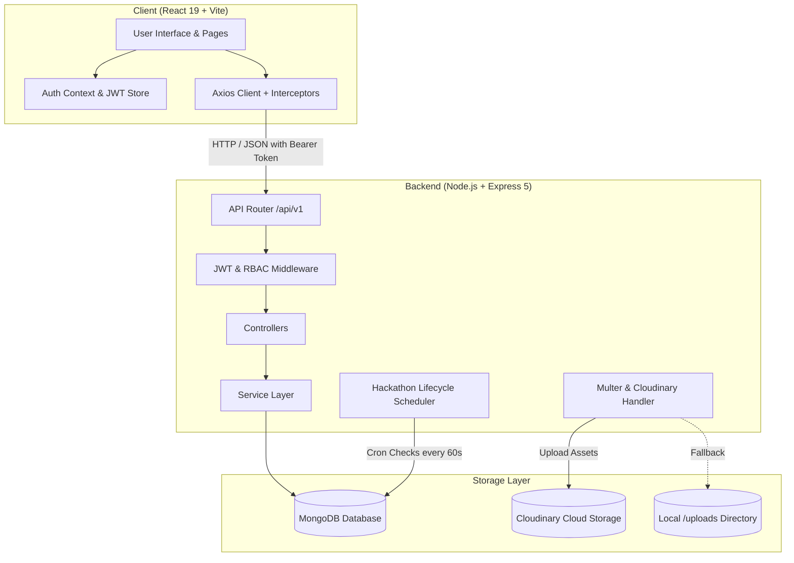

# HackVerse

[](https://github.com/amritraj006/HackVerse/actions/workflows/ci-cd.yml)

HackVerse is an end-to-end hackathon management and project evaluation platform designed to coordinate technical competitions for organizers, participants, and judges. The platform manages the entire competition lifecycle—including event creation, solo or team registration, multi-member team formation with join codes, file-backed project submissions, multi-criteria judge evaluations, automated lifecycle status transitions, and public leaderboard publishing. HackVerse is built with React, Node.js, Express, MongoDB, and Tailwind CSS.

---

## Features

### Authentication & Authorization
* **JWT Authentication**: User registration, login, and session persistence via JSON Web Tokens stored on the client and validated on protected endpoints.
* **Role-Based Access Control (RBAC)**: Enforces distinct access privileges across four user roles: `participant`, `organizer`, `judge`, and `admin`.
* **Account Status Enforcement**: Active validation prevents blocked accounts from authenticating or accessing protected endpoints.

### Participant Features
* **Hackathon Discovery**: Filter, search, and view detailed hackathon briefs, timelines, eligibility rules, and prize pools.
* **Registration Workflows**: Register individually or manage active registrations with cancellation support.
* **Team Collaboration**: Create teams, join teams using unique join codes, invite peers via email, transfer team leadership, and manage member rosters.
* **Project Submission**: Submit repository URLs, live demo links, video presentations, PDF/ZIP documentation, and screenshot galleries. Submissions are strictly restricted to team leaders for team entries.
* **Registration History & Personal Submissions**: Track registered events and inspect previous project submissions.

### Organizer Features
* **Hackathon Lifecycle Management**: Create events with configurable registration deadlines, start/end dates, team size caps, and participant limits.
* **Team & Participant Moderation**: Review registered teams, approve or reject team rosters, and audit solo participants.
* **Judge Assignment**: Invite judges from the platform registry and track invitation acceptance states.
* **Results Publishing**: Review final leaderboard scores in preview mode and publish official rankings and winners.

### Judge Evaluation Portal
* **Assigned Submissions Workspace**: Access project submissions assigned to the judge for evaluation.
* **Multi-Criteria Scoring**: Evaluate projects across custom criteria (e.g., Innovation, Execution, Feasibility) with explicit scores and required written feedback.
* **Automated Score Aggregation**: Computes the overall project score as the arithmetic mean of all judge evaluations.
* **Winner Designation**: Mark winning projects and assign award positions upon review completion.

### System Administration
* **Platform Analytics**: Aggregate operational counts across total users, role distributions, hackathon statuses, and submission volumes.
* **User Management**: Search, filter, inspect, update roles, and toggle block status or delete user accounts.
* **Event Governance**: Platform-wide view to inspect and remove hackathons or invalid submissions.
* **Automatic Admin Seeding**: Automatically seeds a default administrator account on first boot if no admin exists.

### Platform Automation & Infrastructure
* **Automated Lifecycle Scheduler**: A background scheduler checks competition dates periodically (every 60 seconds by default), transitioning events from `upcoming` to `ongoing` to `ended` and initializing result states.
* **Tiered API Rate Limiting**: Guards against brute-force attacks and volumetric traffic with distinct limiters for global endpoints (150 req/15 min), authentication routes (10 req/15 min), and file uploads (20 req/15 min).
* **Circuit Breaker Pattern**: Wraps external Cloudinary media interactions with a 3-state (`CLOSED`, `OPEN`, `HALF_OPEN`) circuit breaker, failing fast and routing to local `/uploads` storage when the cloud provider degrades.
* **Process-Level Load Balancer**: Multi-worker process clustering using Node.js `node:cluster` to balance incoming HTTP requests across CPU cores via round-robin distribution with automatic worker revival.
* **Docker Containerization**: Multi-stage Dockerfiles for client (Nginx) and server (Node.js Alpine) orchestrated via `docker-compose.yml` with MongoDB health checks and persistent volume mounts.
* **Dual Storage Pipeline**: Image and document uploads upload directly to Cloudinary when credentials are configured, with automatic fallback to local disk storage (`/uploads`).

---

## Tech Stack

| Category | Technology |
| --- | --- |
| **Frontend Framework** | React 19 (Vite 8) |
| **Routing** | React Router v7 (`react-router-dom`) |
| **Styling** | Tailwind CSS v4, Lucide React (Icons) |
| **Data Visualization** | Recharts |
| **Notifications** | React Hot Toast |
| **HTTP Client** | Axios (with request & response interceptors) |
| **Backend Runtime** | Node.js |
| **Web Framework** | Express 5 |
| **Database** | MongoDB |
| **Object Data Modeling** | Mongoose 9 |
| **Authentication & Security** | JSON Web Tokens (`jsonwebtoken`), `bcryptjs`, `express-rate-limit` |
| **Resilience & Fault Tolerance**| Circuit Breaker (`CLOSED`, `OPEN`, `HALF_OPEN`), Node.js `cluster` |
| **Containerization & Proxy** | Docker, Docker Compose, Nginx Alpine |
| **CI/CD & Automation** | GitHub Actions |
| **File Upload Handling** | Multer |
| **Cloud Storage** | Cloudinary (with local storage fallback) |
| **Validation** | Express Validator |

---

## System Architecture

HackVerse uses a decoupled client-server architecture with a single RESTful API layer interacting with MongoDB for persistence and Cloudinary for media assets.



### Communication Flow
1. **Client Interaction**: React views dispatch actions through typed service wrappers that use an Axios instance configured with a base URL (`/api/v1`).
2. **Request Interception**: Axios attaches the stored JWT (`Bearer <token>`) to request headers automatically.
3. **Middleware Pipeline**: Requests pass through CORS validation, body parsing, JWT signature verification (`protect`), and role validation (`authorize`).
4. **Service Layer**: Business logic—including validation of hackathon dates, leader-only submission restrictions, scoring aggregation, and invitation acceptance—is encapsulated inside standalone services.
5. **Data Access**: Mongoose models execute queries against indexed MongoDB collections.

---

## Project Structure

```text
HackVerse/
├── client/                      # React frontend application
│   ├── public/                  # Static assets and icons
│   ├── src/
│   │   ├── components/          # Reusable UI elements (Buttons, Modals, Cards, Tables)
│   │   ├── context/             # React Contexts (AuthContext, ThemeContext)
│   │   ├── hooks/               # Custom hooks (useQueryParams)
│   │   ├── layouts/             # Page layouts (MainLayout, AuthLayout)
│   │   ├── pages/               # Top-level route pages (Home, Hackathons, Teams, Projects)
│   │   │   ├── admin/           # Admin Console page
│   │   │   ├── dashboards/      # Role-specific dashboards (Admin, Judge, Organizer, Participant)
│   │   │   └── organizer/       # Hackathon management workspace
│   │   ├── services/            # Axios API service integrations
│   │   ├── utils/               # Constants, helpers, and formatters
│   │   ├── App.jsx              # Main router and route definitions
│   │   └── main.jsx             # React entry point
│   ├── package.json             # Frontend dependencies and build scripts
│   └── vite.config.js           # Vite configuration
│
├── server/                      # Node.js Express backend
│   ├── config/                  # Database connection and Cloudinary setup
│   ├── controllers/             # Express request/response handlers
│   ├── middleware/              # Auth, RBAC, error handling, and Multer upload
│   ├── models/                  # Mongoose schemas (User, Hackathon, Team, Submission, etc.)
│   ├── routes/                  # API endpoint definitions grouped by feature
│   ├── services/                # Core business logic and database operations
│   ├── uploads/                 # Local directory for file uploads (fallback)
│   ├── utils/                   # Lifecycle scheduler, admin seeder, logger, response wrappers
│   ├── validations/             # Input validation schemas (express-validator)
│   ├── app.js                   # Express application and middleware mounting
│   ├── server.js                # Server entry point and database initialization
│   ├── package.json             # Backend dependencies and run scripts
│   └── .env.example             # Backend environment variable template
└── README.md
```

---

## Key Implementation Details

### 1. Role-Based Access Control (RBAC)
User accounts are classified into one of four roles: `participant`, `organizer`, `judge`, or `admin`. Protected routes execute an authorization middleware stack:
* `protect`: Verifies the JWT signature, decodes the user ID, verifies the account still exists, and confirms that `isBlocked` is false.
* `authorize(...roles)`: Verifies that the authenticated user possesses an allowed role before controller execution.

### 2. Automated Lifecycle State Machine
A scheduled background process (`server/utils/hackathonScheduler.js`) runs at 60-second intervals:
* Transitions hackathons from `upcoming` to `ongoing` when the current timestamp exceeds `startDate`.
* Transitions hackathons from `ongoing` to `ended` when the current timestamp exceeds `endDate`.
* Flags `resultStatus` to `pending` for concluded hackathons awaiting judge evaluations.
* Project submission mutations and registrations are programmatically rejected if attempted outside the valid active time window.

### 3. Team Formation & Join Codes
Teams are scoped to a specific hackathon. The creator becomes the `leader`, and an alphanumeric `joinCode` is generated for the team. Participants can join directly using the code or accept email-based invitation notifications. Only the team leader is authorized to submit projects, edit submissions, or manage member rosters.

### 4. Judge Scoring & Evaluation
When an organizer assigns judges to an event, notifications are dispatched. Upon acceptance, judges access the assigned evaluation workspace. Each project evaluation captures:
* Individual numerical marks across specific criteria (e.g., Code Quality, Impact, Presentation).
* Written qualitative feedback.
* An average overall score aggregated from all submitted judge evaluations.

### 5. Dual File Storage Strategy
File uploads (user avatars, presentation decks, project screenshots) pass through Multer with file type filtering (`.jpeg`, `.jpg`, `.png`, `.gif`, `.pdf`, `.zip`) and size limits. If Cloudinary environment variables are present, files are streamed to cloud storage and local temp copies are pruned. If credentials are not configured, the system writes to `/uploads` with a static URL path fallback.

### 6. Tiered Rate Limiting Architecture
Configured via `express-rate-limit` to mitigate DoS, brute-force attacks, and abusive file uploads:
* **Global API Limiter**: Enforces a threshold of 150 requests per 15-minute window across `/api/v1`.
* **Auth Rate Limiter**: Restricts `/api/v1/auth/login`, `/signup`, and `/register` to 10 attempts per 15 minutes, returning HTTP 429 and `RateLimit-*` headers.
* **Upload Rate Limiter**: Caps multipart file upload endpoints to 20 requests per 15 minutes.
* Reverse-proxy awareness configured via `app.set('trust proxy', 1)` to ensure accurate client IP identification through Nginx or Docker networks.

### 7. Circuit Breaker Pattern for External Services
External dependencies (Cloudinary API) are wrapped in a 3-state state machine (`server/utils/CircuitBreaker.js`):
* **`CLOSED`**: Requests proceed normally. Consecutive failures are tracked up to a threshold (default: 3).
* **`OPEN`**: Tripped upon threshold breach. Immediately short-circuits calls to the fallback handler without network latency, preventing thread starvation.
* **`HALF_OPEN`**: After a 30-second cooldown period, a single probe request is permitted. A successful response closes the circuit; failure re-opens it.
* Diagnostics and real-time state are exposed through the `/api/v1/health` endpoint.

### 8. Multi-Process Load Balancing (Node.js Cluster)
When `CLUSTER_MODE=true` is enabled, `server.js` initiates process clustering using Node.js `node:cluster`:
* The primary master process forks worker processes equal to `WEB_CONCURRENCY` (or system CPU count).
* The OS kernel distributes incoming connections evenly across workers using round-robin scheduling.
* Master process monitors worker health and automatically spawns replacement workers upon unhandled exits.
* Background singletons (`seedAdmin()` and `startHackathonScheduler()`) execute exclusively on the master process to eliminate duplicate cron intervals.

---

## CI/CD Pipeline

HackVerse includes an automated continuous integration and delivery pipeline implemented using **GitHub Actions** (`.github/workflows/ci-cd.yml`):

* **Triggers**: Executed on every `push` and `pull_request` targeting the `main` branch, as well as manual runs via `workflow_dispatch`.
* **Concurrency Control**: Automatically cancels outdated in-progress workflow runs on rapid branch updates.
* **Frontend CI (`frontend-ci`)**:
  * Sets up Node.js 20 with npm dependency caching.
  * Runs ESLint (`npm run lint`) for code quality and style compliance.
  * Builds the Vite React production bundle (`npm run build`).
* **Backend CI (`backend-ci`)**:
  * Sets up Node.js 20 with npm dependency caching.
  * Validates script integrity and executes syntax checks (`npm test`).
* **Docker Validation (`docker-compose-validate`)**:
  * Validates the multi-container `docker-compose.yml` configuration and environment mapping.
* **Docker Build & Verify (`docker-build`)**:
  * Sets up Docker Buildx and QEMU.
  * Builds both the backend and frontend multi-stage Docker images using GitHub Actions cache (`type=gha`) for fast builds.
* **Continuous Delivery (`cd-pipeline`)**:
  * Validates complete pipeline readiness upon successful merges into `main`.

---

## API Overview

The backend exposes a versioned RESTful API under `/api/v1`.

| Method | Endpoint | Purpose | Authentication |
| --- | --- | --- | --- |
| `GET` | `/api/v1/health` | Service health status | Public |
| `POST` | `/api/v1/auth/signup` | Register a new user account | Public |
| `POST` | `/api/v1/auth/login` | Authenticate user and return JWT | Public |
| `POST` | `/api/v1/auth/logout` | Client session logout | Public |
| `GET` | `/api/v1/auth/me` | Fetch authenticated user data | Bearer Token |
| `GET` | `/api/v1/users/profile` | Fetch profile details of current user | Bearer Token |
| `PUT` | `/api/v1/users/profile` | Update profile information (name, bio, skills, role) | Bearer Token |
| `POST` | `/api/v1/users/profile/avatar` | Upload user profile avatar | Bearer Token |
| `GET` | `/api/v1/users/:id` | Get public user profile | Public |
| `GET` | `/api/v1/hackathons` | List public hackathons with filters and pagination | Public |
| `GET` | `/api/v1/hackathons/:id` | Get single hackathon details | Public |
| `GET` | `/api/v1/hackathons/:id/leaderboard` | Get published leaderboard | Public |
| `GET` | `/api/v1/hackathons/my-events` | Get events created by logged-in organizer | Organizer, Admin |
| `POST` | `/api/v1/hackathons` | Create a new hackathon | Organizer, Admin |
| `PUT` | `/api/v1/hackathons/:id` | Update hackathon configuration | Organizer, Admin |
| `DELETE` | `/api/v1/hackathons/:id` | Delete hackathon | Organizer, Admin |
| `PUT` | `/api/v1/hackathons/:id/registration` | Toggle registration open/closed status | Organizer, Admin |
| `PUT` | `/api/v1/hackathons/:id/judges` | Assign judges to hackathon | Organizer, Admin |
| `PUT` | `/api/v1/hackathons/:id/results` | Publish competition winners and results | Organizer, Admin |
| `GET` | `/api/v1/hackathons/:id/teams` | Get registered teams for hackathon | Organizer, Admin |
| `GET` | `/api/v1/hackathons/:id/participants` | Get solo registered participants | Organizer, Admin |
| `PUT` | `/api/v1/hackathons/:id/teams/:teamId/status` | Approve or reject a team | Organizer, Admin |
| `GET` | `/api/v1/hackathons/:id/submissions` | Get project submissions for an event | Organizer, Judge, Admin |
| `GET` | `/api/v1/hackathons/:id/leaderboard/preview` | Preview leaderboard prior to publishing | Organizer, Admin |
| `GET` | `/api/v1/hackathons/:id/judge-view` | Contextual dashboard view for judges | Judge, Admin |
| `POST` | `/api/v1/registrations/:hackathonId` | Register current user for an event | Participant, Admin |
| `DELETE` | `/api/v1/registrations/:hackathonId` | Cancel event registration | Participant, Admin |
| `GET` | `/api/v1/registrations/my-registrations` | Fetch user registration history | Bearer Token |
| `GET` | `/api/v1/registrations/:hackathonId/status` | Check registration status for an event | Bearer Token |
| `POST` | `/api/v1/teams` | Create a new team | Participant, Admin |
| `POST` | `/api/v1/teams/join` | Join a team via join code | Participant, Admin |
| `GET` | `/api/v1/teams/my-teams` | Fetch all teams the user belongs to | Bearer Token |
| `GET` | `/api/v1/teams/:id` | Fetch team details and roster | Bearer Token |
| `POST` | `/api/v1/teams/:id/invite` | Send team invitation by email | Team Leader |
| `DELETE` | `/api/v1/teams/:id/members/:memberId` | Remove member from team | Team Leader |
| `PUT` | `/api/v1/teams/:id/transfer-leadership` | Transfer team leadership | Team Leader |
| `POST` | `/api/v1/teams/:id/leave` | Leave a team | Team Member |
| `DELETE` | `/api/v1/teams/:id` | Delete team | Team Leader, Admin |
| `POST` | `/api/v1/submissions` | Submit or update project submission | Participant, Admin |
| `GET` | `/api/v1/submissions` | Public showcase of all submitted projects | Public |
| `GET` | `/api/v1/submissions/my-submissions` | Get submissions created by the user | Bearer Token |
| `GET` | `/api/v1/submissions/assigned` | Get submissions assigned to logged-in judge | Judge, Admin |
| `POST` | `/api/v1/submissions/:id/evaluations` | Submit criteria evaluation and feedback | Judge, Admin |
| `PUT` | `/api/v1/submissions/:id/winner` | Declare submission as winner | Judge, Admin |
| `GET` | `/api/v1/submissions/:id` | Get submission details | Public |
| `DELETE` | `/api/v1/submissions/:id` | Delete submission | Owner, Admin |
| `GET` | `/api/v1/notifications` | Get user notifications | Bearer Token |
| `PUT` | `/api/v1/notifications/read-all` | Mark all notifications as read | Bearer Token |
| `POST` | `/api/v1/notifications/:id/accept` | Accept team or judge invitation | Bearer Token |
| `POST` | `/api/v1/notifications/:id/reject` | Reject team or judge invitation | Bearer Token |
| `GET` | `/api/v1/admin/analytics` | Fetch platform-wide counts and statistics | Admin |
| `GET` | `/api/v1/admin/users` | List users with search, role filters, pagination | Admin |
| `PUT` | `/api/v1/admin/users/:id/block` | Toggle user block status | Admin |
| `PUT` | `/api/v1/admin/users/:id/role` | Update user system role | Admin |
| `DELETE` | `/api/v1/admin/users/:id` | Delete user record | Admin |
| `GET` | `/api/v1/admin/hackathons` | List hackathons for admin governance | Admin |
| `DELETE` | `/api/v1/admin/hackathons/:id` | Delete hackathon | Admin |
| `GET` | `/api/v1/admin/submissions` | List all submissions for admin audit | Admin |
| `DELETE` | `/api/v1/admin/submissions/:id` | Delete submission | Admin |

---

## Database

HackVerse uses **MongoDB** with schemas defined via **Mongoose**.

### Primary Collections & Schema Design

* **Users (`User`)**
  * Fields: `name`, `email` (unique), `password` (hashed with bcrypt, excluded by default), `role` (`participant`, `organizer`, `judge`, `admin`), `avatar`, `bio`, `skills`, `isBlocked`, `wins` (array referencing hackathon and submission).
  * Indexes: Text index on `name` and `email`; compound index on `{ role: 1, isBlocked: 1, createdAt: -1 }`.

* **Hackathons (`Hackathon`)**
  * Fields: `title`, `description`, `tagline`, `organizer` (ref `User`), `startDate`, `endDate`, `registrationDeadline`, `status` (`upcoming`, `ongoing`, `ended`), `resultStatus` (`pending`, `published`), `maxTeamSize`, `maxParticipants`, `prizePool`, `bannerImage`, `tags`, `isRegistrationOpen`, `assignedJudges` (refs `User`), `pendingJudges` (refs `User`), `isResultsPublished`, `winners`.
  * Indexes: Text index on `title`, `tagline`, `description`; compound index on `{ status: 1, createdAt: -1 }`; index on `startDate`.

* **Teams (`Team`)**
  * Fields: `name`, `hackathon` (ref `Hackathon`), `leader` (ref `User`), `members` (refs `User`), `status` (`pending`, `approved`, `rejected`), `joinCode`, `pendingInvites`.
  * Indexes: Compound index on `{ hackathon: 1, status: 1, createdAt: -1 }`; index on `joinCode`.

* **Registrations (`Registration`)**
  * Fields: `hackathon` (ref `Hackathon`), `participant` (ref `User`), `status` (`active`, `cancelled`), `registeredAt`.
  * Indexes: Compound unique index on `{ hackathon: 1, participant: 1 }` to enforce single registration per user per event.

* **Submissions (`Submission`)**
  * Fields: `hackathon` (ref `Hackathon`), `team` (ref `Team`), `submittedBy` (ref `User`), `teamMembers` (refs `User`), `title`, `tagline`, `description`, `repositoryUrl`, `demoUrl`, `videoUrl`, `presentationFile`, `screenshots`, `status` (`draft`, `submitted`), `score`, `isWinner`, `winnerPosition`, `evaluations` (sub-documents with `judge`, `score`, `criteriaScores`, `feedback`, `evaluatedAt`).
  * Indexes: Text index on `title`, `tagline`, `description`; compound index on `{ hackathon: 1, status: 1, score: -1 }`.

* **Notifications (`Notification`)**
  * Fields: `user` (ref `User`), `sender` (ref `User`), `type` (`team_invite`, `team_removed`, `system`, `hackathon`, `judge_invite`), `title`, `message`, `team` (ref `Team`), `hackathon` (ref `Hackathon`), `status` (`pending`, `accepted`, `rejected`, `read`).
  * Indexes: Compound index on `{ user: 1, createdAt: -1 }`.

---

## Authentication & Authorization

Authentication is based on stateless JSON Web Tokens (JWT):

1. **Credentials & Hashing**: Passwords are automatically hashed using `bcryptjs` (salt rounds: 10) during pre-save hooks on the User model.
2. **Issuance**: On successful `/api/v1/auth/login` or `/api/v1/auth/signup`, the server issues a signed JWT payload containing `{ id, email, role }` with a configurable expiry (default: 7 days).
3. **Client Storage & State**: Tokens are stored in browser `localStorage`. An `AuthContext` provider loads current user state via `/api/v1/auth/me` on startup.
4. **Request Interception**: An Axios request interceptor attaches the header `Authorization: Bearer <token>` to all outbound API calls.
5. **Route Guards**:
   * **Frontend**: `ProtectedRoute` checks authentication status and allowed role lists, redirecting unauthenticated users to `/login` and unauthorized roles to `/unauthorized`.
   * **Backend**: `protect` middleware decodes and validates the token. `authorize(...roles)` blocks unauthorized roles with HTTP 403.

---

## Installation & Setup

### Option A: Quick Start with Docker Compose (Recommended)
You can launch the entire stack—MongoDB, Node.js backend, and Nginx frontend—with a single command:

```bash
# 1. Clone repository
git clone https://github.com/amritraj006/HackVerse.git
cd HackVerse

# 2. Build and start all containers in detached mode
docker compose up --build -d

# 3. View container health and logs
docker compose ps
docker compose logs -f
```
* **Frontend Web Application**: Accessible at `http://localhost:5173`.
* **Backend REST API**: Accessible at `http://localhost:8341/api/v1`.
* **MongoDB**: Accessible on `localhost:27017` with data persisted in the `mongo_data` volume.

To stop the containers:
```bash
docker compose down
```

---

### Option B: Manual Local Setup

#### Prerequisites
* [Node.js](https://nodejs.org/) (v18 or higher recommended)
* [npm](https://www.npmjs.com/)
* [MongoDB](https://www.mongodb.com/) (local instance running on port 27017 or MongoDB Atlas connection URI)

#### 1. Clone Repository
```bash
git clone https://github.com/amritraj006/HackVerse.git
cd HackVerse
```

#### 2. Configure Backend Environment
Create a `.env` file in the `server` directory:

```bash
cd server
cp .env.example .env
```

Populate the required environment variables in `server/.env`.

### 3. Install Backend Dependencies
```bash
npm install
```

### 4. Configure Frontend Environment
Create a `.env` file in the `client` directory:

```bash
cd ../client
cp .env.example .env
```

Ensure `VITE_API_BASE_URL` points to the backend server URL.

### 5. Install Frontend Dependencies
```bash
npm install
```

---

## Environment Variables

### Backend (`server/.env`)
```env
PORT=8341
NODE_ENV=development
CLIENT_URL=http://localhost:5173
MONGO_URI=mongodb://localhost:27017/hackverse
JWT_SECRET=your_jwt_secret_key_here
JWT_EXPIRES_IN=7d

# Process Cluster / Load Balancer Settings
CLUSTER_MODE=false
WEB_CONCURRENCY=2

# Rate Limiting Configuration
RATE_LIMIT_WINDOW_MS=900000
RATE_LIMIT_MAX_REQUESTS=150
AUTH_RATE_LIMIT_MAX=10
UPLOAD_RATE_LIMIT_MAX=20

# Circuit Breaker Configuration
CIRCUIT_BREAKER_FAILURES=3
CIRCUIT_BREAKER_RECOVERY_MS=30000
CIRCUIT_BREAKER_TIMEOUT_MS=8000

# File Upload Settings
MAX_FILE_SIZE=5242880
UPLOAD_DIR=uploads

# Cloudinary (Optional - local fallback used if blank)
CLOUDINARY_CLOUD_NAME=
CLOUDINARY_API_KEY=
CLOUDINARY_API_SECRET=

# Default Admin Account (Optional - fallback defaults used if blank)
ADMIN_EMAIL=admin@hackverse.io
ADMIN_PASSWORD=your_secure_password
```

### Frontend (`client/.env`)
```env
VITE_API_BASE_URL=http://localhost:8341/api/v1
VITE_APP_NAME=HackVerse
```

---

## Running the Project

Run backend and frontend development servers concurrently in separate terminals.

### Start Backend Server
```bash
cd server
npm run dev
```
* The backend server runs by default on `http://localhost:8341`.
* Initial startup connects to MongoDB, runs the default Super Admin seeder, and starts the lifecycle scheduler.
* Health check endpoint: `http://localhost:8341/api/v1/health`.

### Start Frontend Client
```bash
cd client
npm run dev
```
* The Vite development server runs by default on `http://localhost:5173`.

---

## Future Improvements

* Real-time notification delivery via WebSockets / Socket.io.
* Automated certificate generation for event participants and winners.
* Plagiarism and similarity detection across submitted code repositories.
* Integration with third-party OAuth providers (e.g., GitHub, Google sign-in).
* Exportable analytics reports (CSV/PDF) for hackathon organizers.

---

## Author

**Amrit Raj**  
* GitHub: [@amritraj006](https://github.com/amritraj006)
